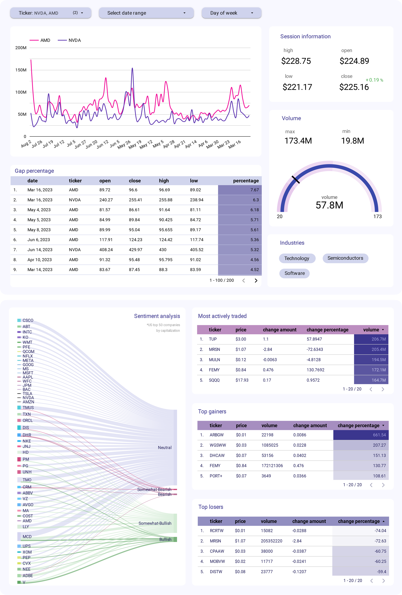

# Real-time stock pipeline: from Kafka to GCS

This pipeline handles real-time data about stocks and stock news. Data from AlphaVantage API passes through Kafka 
in real-time, is processed with Apache Spark, and stored for analysis in Google Cloud Storage. Airflow orchestrates 
the process and Docker is used for containerization.

The following demonstrates an example of a finished dashboard from collected data using Looker


### Technology stack

- Apache Kafka: used as the data source to ingest real-time data streams
- Apache Spark: processes and transforms data before storage
- Airflow: orchestrates the data pipeline and schedules data ingestion tasks
- Google Cloud Storage (GCS): stores the ingested data
- FastAPI: provides a RESTful API for triggering data ingestion
- Docker: containerization of the project
- Looker: BI tool used to create interactive dashboard

### Setup and usage

To run the project, follow these steps:.

1. Build and start the project containers using docker-compose
   ```bash 
   docker-compose up --build
   ```
2. Enter all necessary parameters in the `src/data_pipeline/config.py` and `airflow/.env` files
3. Access the Airflow UI at http://localhost:8080 to monitor and manage the data pipeline.
4. Access the FastAPI API at http://localhost:8000/docs to trigger data ingestion.

The project includes unit and integration tests to ensure the correctness of components. To run the tests:
```
python -m pytest tests/
```

### License

This project is licensed under the [MIT License](#https://github.com/nadyinky/av-stock-pipeline/blob/fb4858cd334f336f9ef0b5d832fdac2ad21093a8/LICENSE).